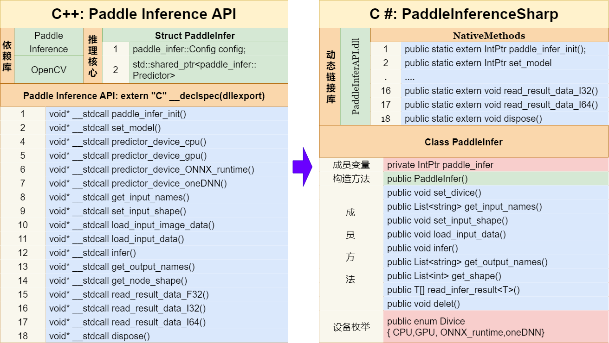

# 基于C#和Paddle Inference 部署PaddlePaddle模型——PaddleInferenceSharp

# 1. 项目介绍

&emsp; Paddle Inference 是飞桨的原生推理库， 提供服务器端的高性能推理能力，直接基于飞桨的训练算子，因此它支持飞桨训练出的所有模型的推理；Paddle Inference 功能特性丰富，性能优异，针对不同平台不同的应用场景进行了深度的适配优化，做到高吞吐、低时延，保证了飞桨模型在服务器端即训即用，快速部署。

&emsp; 但由于Paddle Inference目前只提供了Python、C++、C、Go语言方法接口，C#无法直接使用。近几年以来 ，C#语言快速发展，并跻身于编程语言排行榜前几名的位置，为了能够在C#语言中调用Paddle Inference模型推理库，根据C++动态链接库的原理，推出PaddleInferenceSharp。

# 2. PaddleInfer类 

## 2.1 API 方法

<table>
	<tr>
	    <th width="7%" align="center" bgcolor=#FF7A68>序号</th>
	    <th width="35%" colspan="2" align="center" bgcolor=#FF7A68>API</th>
	    <th width="43%" align="center" bgcolor=#FF7A68>参数解释</th>  
        <th width="15%" align="center" bgcolor=#FF7A68>说明</th>
	</tr >
	<tr >
	    <td rowspan="3" align="center">1</td>
	    <td align="center">方法</td>
        <td>PaddleInfer()</td>
        <td>构造函数，初始化推理核心，读取本地模型</td>
        <td rowspan="3"></td>
	</tr>
    <tr >
	    <td rowspan="2" align="center">参数</td>
        <td>string model_path</td>
        <td>静态图模型文件</td>
	</tr>
    <tr >
        <td>string params_path</td>
        <td>模型配置文件信息，默认为空</td>
	</tr>
    <tr >
	    <td rowspan="5" align="center">2</td>
	    <td align="center">方法</td>
        <td>void set_divice()</td>
        <td>设置推理设备</td>
        <td rowspan="5">支持 CPU、GPU、ONNX runtime、oneDNN</td>
	</tr>
    <tr >
	    <td rowspan="4" align="center">参数</td>
        <td>Divice divice</td>
        <td>设备名称选择</td>
	</tr>
    <tr >
        <td>int num </td>
        <td>对于CPU、ONNX runtime代表线程数，默认为10； 对于GPU代表显卡编号，默认为0； 对于oneDNN代表cache数量，默认为1 </td>
	</tr>
    <tr >
        <td>ulong memory_init_size</td>
        <td>显存分配空间(在使用GPU时作用)，默认为500</td>
	</tr>
    <tr >
        <td>int workspace_size</td>
        <td>显存工作空间(在使用GPU时作用)，默认为30</td>
	</tr>
	<tr >
	    <td rowspan="1" align="center">3</td>
	    <td align="center">方法</td>
        <td>List  &ltstring&gt get_input_names()</td>
        <td>获取输入节点名字</td>
        <td rowspan="1"></td>
	</tr>
	<tr >
	    <td rowspan="3" align="center">4</td>
	    <td align="center">方法</td>
        <td>void set_input_shape()</td>
        <td>设置输入节点形状</td>
        <td rowspan="3">根据节点维度设置</td>
	</tr>
    <tr >
	    <td rowspan="2" align="center">参数</td>
        <td>int[] input_shape</td>
        <td>形状数组</td>
	</tr>
    <tr >
        <td>string input_name</td>
        <td>节点名称</td>
	</tr>
	<tr >
	    <td rowspan="7" align="center">5</td>
	    <td align="center">方法</td>
        <td>void load_input_data()</td>
        <td>设置图片/普通输入数据</td>
        <td rowspan="7">方法重载</td>
	</tr>
    <tr >
	    <td rowspan="2" align="center">参数</td>
        <td>string input_name</td>
        <td>输入节点名称</td>
	</tr>
    <tr >
        <td>float[] input_data</td>
        <td>输入数据</td>
	</tr>
    <tr >
	    <td rowspan="4" align="center">参数</td>
        <td>string input_name</td>
        <td>输入节点名称</td>
	</tr>
    <tr >
        <td>byte[] image_data</td>
        <td>图片数据</td>
	</tr>
    <tr >
        <td>ulong image_size</td>
        <td>图片长度</td>
	</tr>
    <tr >
        <td>int type</td>
        <td>数据处理类型： type == 0: 均值方差归一化、直接缩放 type == 1: 普通归一化、直接缩放 type == 2: 均值方差归一化、仿射变换</td>
	</tr>
	<tr >
	    <td rowspan="1" align="center">6</td>
	    <td align="center">方法</td>
        <td>void infer()</td>
        <td>模型推理</td>
        <td rowspan="1"></td>
	</tr>
	<tr >
	    <td rowspan="1" align="center">7</td>
	    <td align="center">方法</td>
        <td>List  &ltstring&gt get_output_names()</td>
        <td>获取输出节点名字</td>
        <td rowspan="1"></td>
	</tr>
	<tr >
	    <td rowspan="2" align="center">8</td>
	    <td align="center">方法</td>
        <td>List  &ltint&gt get_shape()</td>
        <td>获取指定节点形状</td>
        <td rowspan="2"></td>
	</tr>
    <tr >
	    <td rowspan="1" align="center">参数</td>
        <td>string node_name</td>
        <td>节点名称</td>
	</tr>
	<tr >
	    <td rowspan="3" align="center">9</td>
	    <td align="center">方法</td>
        <td>void T[] read_infer_result &ltT&gt()</td>
        <td>读取推理结果数据</td>
        <td rowspan="3">支持读取Float32、Int32、Int64格式数据</td>
	</tr>
    <tr >
	    <td rowspan="2" align="center">参数</td>
        <td>string output_name</td>
        <td>输出节点名</td>
	</tr>
    <tr >
        <td>int data_size</td>
        <td>输出数据长度</td>
	</tr>
	<tr >
	    <td rowspan="1" align="center">10</td>
	    <td align="center">方法</td>
        <td>void delet()</td>
        <td>删除内存地址</td>
        <td rowspan="1"></td>
	</tr>

## 2.2 枚举

<table>
	<tr>
	    <th width="10%" align="center" bgcolor=#FF7A68>序号</th>
	    <th width="20%"  align="center" bgcolor=#FF7A68>枚举名</th>
	    <th width="30%" align="center" bgcolor=#FF7A68>枚举变量</th>  
        <th width="40%" align="center" bgcolor=#FF7A68>含义</th>
	</tr >
	<tr >
	    <td rowspan="4" align="center">1</td>
        <td rowspan="4" align="center">Divice 设备名称 </td>
        <td align="center">CPU</td>
        <td>使用CPU推理</td>
	</tr>
	<tr >
        <td align="center">GPU</td>
        <td>使用GPU推理</td>
	</tr>
	<tr >
        <td align="center">ONNX_runtime</td>
        <td>使用ONNX_runtime推理</td>
	</tr>
	<tr >
        <td align="center">oneDNN</td>
        <td>使用oneDNN推理</td>
	</tr>
